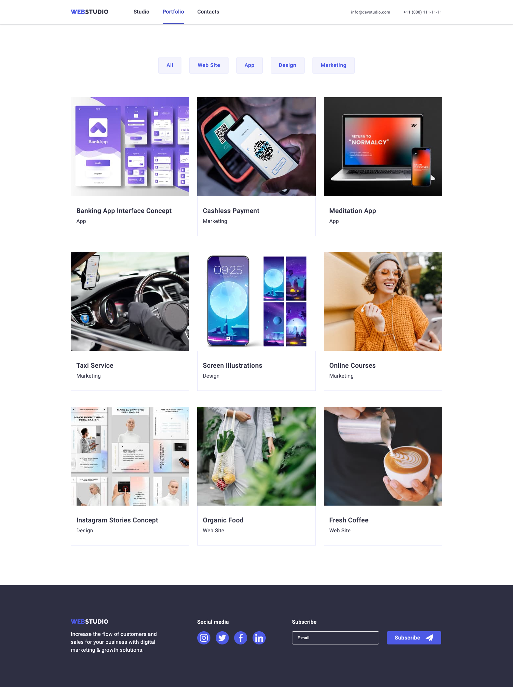
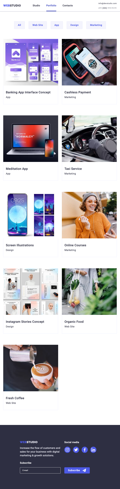

# Домашнє завдання № 6

- Створи репозиторій `goit-markup-hw-06`.
- Склонуй створений репозиторій і скопіюй в нього файли попередньої роботи.
- Виконай верстку адаптивної версії усіх сторінок та елементів макета
  [**домашнього завдання #6**](<https://www.figma.com/file/Kr5Q4EVrEAqpOWko4QeEJb/Web-Studio-(Version-4.0)?type=design&node-id=297046-1554&mode=design&t=FEkHoFMrmvxZLtIl-0>).
- Налаштуй `GitHub Pages` і додай посилання на живу сторінку в шапку
  GitHub-репозиторія.

## Критерії приймання роботи наставником

Для здачі домашнього завдання достатньо зробити адаптивну верстку головної
сторінки (`index.html`). Виконання адаптивної верстки сторінки портфорліо
(`portfolio.html`) не обов'язкове для здачі домашнього завдання.

### Проект

**`«A1»`** При перегляді сторінки на будь-якому пристрої шириною від `320px`, не
з'являється горизонтальна смуга прокручування.

**`«A2»`** Скрипт мобільного меню підключений в HTML окремим файлом
`mobile-menu.js`.

**`«A3»`** Повний приклад створення мобільного меню з уже написаним скриптом
розбери у [**майстерні**](https://github.com/goitacademy/mobile-menu-workshop).

## Розмітка

**`«B1»`** У всіх сторінок в блоці `<head>` є метатег `viewport`.

**`«B2»`** Всі фонові і контентні растрові зображення - респонсивні і
підтримують екрани щільністю `x1` і `x2`.

**`«B3»`** Для респонсивних фонових зображень використані медіа-фукцніі
`min-device-pixel-ratio` і `min-resolution`.

**`«B4»`** Виконана розмітка мобільного меню.

## Оформлення

**`«C1»`** При написанні стилів використаний `Mobile First` підхід і
медіа-функція `(min-width: )`.

**`«C2»`** Стилі, необхідні тільки у певному проміжку, закриті в медіа-запити
`(min-width: ) and (max-width: )` або тільки `(max-width: )`.

**`«C3»`** В медіа-запитах відсутнє зайве дублювання стилів.

**`«C4»`** Верстка виконана щодо трьох точок перелому: 428px, 768px і 1158px.

**`«C5»`** Виконано оформлення мобільного меню.

# Web Studio

---

---

---

---

---

